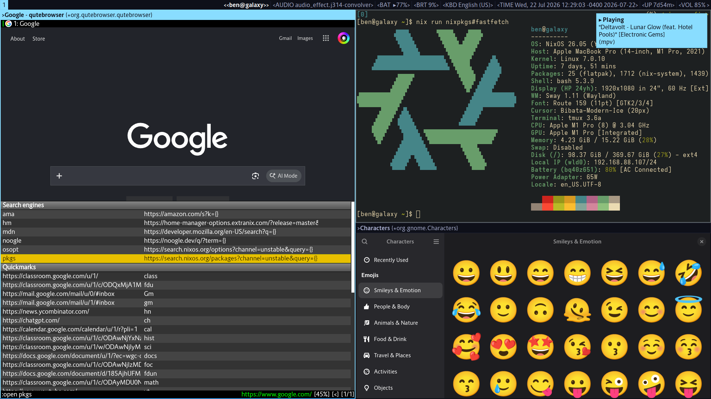
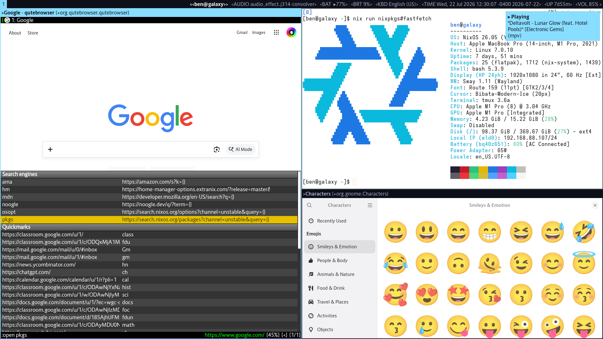

# NixOS Configuration




## About

This configuration includes the following:
- Common NixOS configuration
- Host specific configuration (`/hosts/$HOST`)
- NixOS-specific home-manager modules

It is structured as a flake.

## Flake Structure

### OS Configuration

NixOS Configuration is at `.#nixosConfigurations.<hostname>`. Activate it with `nixos-rebuild test --sudo --flake .#hostname`

### Generic Home Manager

Used to be stored at [benraz123/home-manager-config](https://github.com/benraz123/home-manager-config). Is now a flake output, specifically, `.#packages.<system>.homeConfigurations.ben`. Activate it as  follows:

```sh
$ nix shell nixpkgs#home-manager 
$ home-manager switch --flake .
```

## Adding hosts

1) Copy over `/etc/nixos/${configuration,hardware-configuration}.nix` into `/hosts/$HOST/${default,hardware-configuration.nix}` respectively.
2) Remove redundancies from the default.nix file
3) Add `mkSys` with the relevant information into `outputs.nixosConfigurations`
4) Run:
    ```bash
    [you@host]# nixos-rebuild \
        --extra-experimental-features "pipe-operators" \
        switch \
        --flake path:.#$host
    ```
    (or you can use `test` if you don't want to commit the new configuration to the boot screen)
